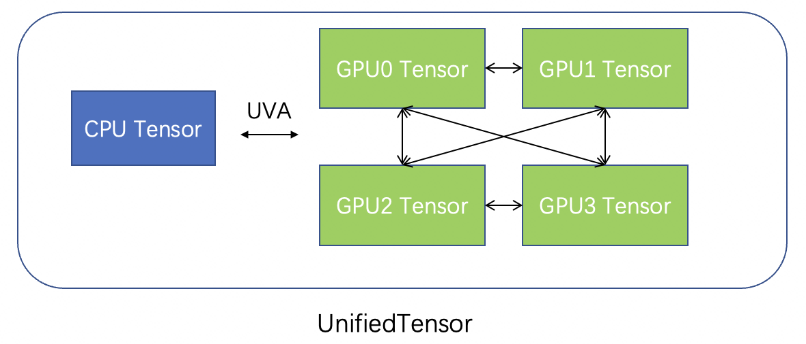
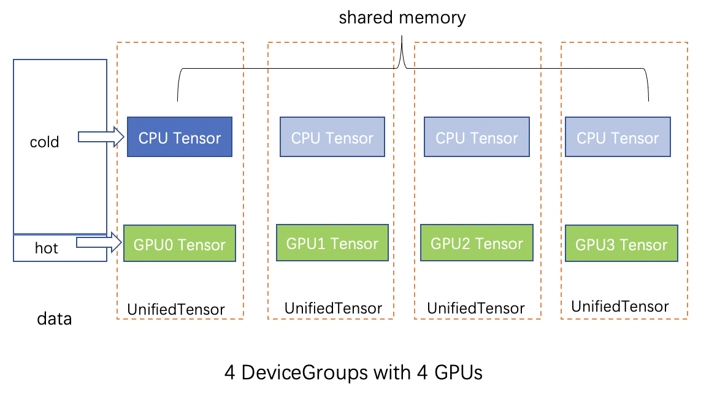

# Graph

A graph is a structure used to represent entities(nodes or vertices) and
their relations(edges). The real-world graphs are usually associated with
node features or edge features.
GLT stores the topology data and feature data of a graph separately, and the
node/edge ids are represented by consecutive integers starting from 0.
The topology data of graph is represented by an instance of
[`graphlearn_torch.data.graph.Graph`](graphlearn_torch.data.graph.Graph) and
the feature data is described by an instance of
[`graphlearn_torch.data.feature.Feature`](graphlearn_torch.data.feature.Feature).


## 1. Graph
A graph can be described by a 2D edge_index Tensor, a CSR matrix, or a CSC matrix.
GLT implements the class [`graphlearn_torch.data.graph.Topology`](graphlearn_torch.data.graph.Topology)
to represent the input data of a graph, which supports edge_index tensor, CSR martix and CSC matrix format.
Then the graph object is described by an instance of
[`graphlearn_torch.data.graph.Graph`](graphlearn_torch.data.graph.Graph),
which takes `Topology` as input and stores the graph data in CPU memory,
pinned memory or GPU memory according to corresponding mode.
Based on `Graph`, GLT provides graph operations(both cpu and cuda versions are available)
like neighbor sampling, negative sampling and subgraph sampling.


### 1.1 Topology

The graph topology data is formed into
[`graphlearn_torch.data.graph.Topology`](graphlearn_torch.data.graph.Topology)
object from edge index (with the format of 'COO', 'CSC' or 'CSR' derectly),
which will be used to build `Graph`.
`Topology` also supports the input `edge_ids` to represent edge ids and will
assign ordinal indices to edges by input order by default.
`Topology` uses `input_layout` to represent the input edge index format and 
`layout` to represent the target edge index format. `input_layout` supports ‘COO’, 
‘CSC’ and ‘CSR’ as input, and `layout` can select ‘CSC’ or ‘CSR’ format, 
which depends on whether the sampling method is in-bound or out-bound.

``` python
class Topology(object):
  r""" Graph topology with support for CSC and CSR formats.

  Args:
    edge_index (a 2D torch.Tensor or numpy.ndarray, or a tuple): The edge
      index for graph topology, in the order of first row and then column. 
    edge_ids (torch.Tensor or numpy.ndarray, optional): The edge ids for
      graph edges. If set to ``None``, it will be aranged by the edge size.
      (default: ``None``)
    input_layout (str): The edge layout representation for the input edge index,
      should be 'COO' (rows and cols uncompressed), 'CSR' (rows compressed)
      or 'CSC' (columns compressed). (default: 'COO')
    layout ('CSR' or 'CSC'): The target edge layout representation for 
      the output. (default: 'CSR')
  """
  def __init__(self, edge_index, edge_ids, input_layout = 'COO', 
               layout: Literal['CSR', 'CSC'] = 'CSR')
```

### 1.2 Graph

The [`graphlearn_torch.data.graph.Graph`](graphlearn_torch.data.graph.Graph)
takes `Topology` as input and supports three storage modes:
  - `CPU`: graph data are stored in the CPU memory and graph
    operations are also executed on CPU.
  - `ZERO_COPY`: graph data are stored in the pinned CPU memory and graph
    operations are executed on GPU.
  - `CUDA`: graph data are stored in the GPU memory and graph operations
    are executed on GPU.

``` python
class Graph(object):
  r""" A graph object used for graph operations such as sampling.

  Args:
    csr_topo (Topology): An instance of ``Topology`` with graph topology data.
    mode (str): The graph operation mode, must be 'CPU', 'ZERO_COPY' or 'CUDA'.
      (Default: 'ZERO_COPY').
    device (int, optional): The target cuda device rank to perform graph
      operations.
  """
  def __init__(self, csr_topo: Topology, mode = 'ZERO_COPY',
               device: Optional[int] = None):
```


## 2. Feature
Feature data of large scale graphs often exceeds the limit of GPU memory,
so we cannot simply use CUDA Tensor to store feature data.
If the feature data is stored in CPU memory,
Large number of data copy operations between
host(CPU) and device(GPU) will be the bottleneck in the whole process of
GPU training.

GLT implements the
[`graphlearn_torch.data.feature.Feature`](graphlearn_torch.data.feature.Feature)
to manage storage of nodes feature and edges feature(not supported yet) and
handle the feature loookup.
When using GPU training, the feature data will be split into two parts according
to different ratios, which will be stored on GPU
(e.g., feature data that are frequently accessed) and pinned memory
respectively. Then a CUDA kernel function is used to perform feature lookup,
reducing the time of data copy and increasing the overall throughput.

### 2.1 UnifiedTensor

Feature consists of a CPU-GPU unified memory instance called
[`graphlearn_torch.data.unified_tensor.UnifiedTensor`](graphlearn_torch.data.unified_tensor.UnifiedTensor).
`UnifiedTensor` unifies the management of CUDA Tensor and CPU Tensor to provide efficient data access.
As shown in the figure below, if GPUs have direct peer2peer access (with NVLink), the memory of
these GPUs can also be unified and managed by `UnifiedTensor`.



Therefore, `UnifiedTensor` can access CUDA Tensor directly,
CUDA Tensor on other GPUs via NVLink, and CPU Tensor by ZERO-COPY via UVA.

One way to create a `UnifiedTensor` is to use the `init_from` method, which takes
a list of CPU Tensors as input and will store each CPU Tensor to their
corresponding device according to `tensor_devices`.

``` python
class UnifiedTensor(object):
  r"""

  Args:
    current_device (int): An integer to represent the GPU device where the
      underlying cuda operation kernel is launched.
    dtype (torch.dtype): The data type of the tensor elements.
  """
  def __init__(self, current_device: int, dtype: torch.dtype = torch.float32):
    self.current_device = current_device
    self.dtype = dtype
    self.unified_tensor = pywrap.UnifiedTensor(current_device, dtype)
    self.cpu_part = None # tensor stored in CPU memory.

  def init_from(self, tensors, tensor_devices):
    r""" Initialize from CPU torch.Tensors.

    Args:
      tensors: CPU torch.Tensors indicating the tensors that need to be stored
        on different GPUs and CPU.
      tensor_devices: The indices of devices indicating the location of the
        tensor storage, -1 means on CPU and other > 0 value means on GPUs.
      Note that tensors and tensor_devices must correspond to each other.
    """
    self.unified_tensor.init_from(tensors, tensor_devices)
```

### 2.2 DeviceGroup

GLT uses an instance of [`graphlearn_torch.data.feature.DeviceGroup`](graphlearn_torch.data.feature.DeviceGroup)
to represent a group of GPUs that have p2p access to each other.
For example, suppose there are 8 GPUs, if there is no NVLink between each other, then there will be 8 DeviceGroups,
each of which has one GPU.
And if GPU #[0,1,2,3] have NVLink connections between each other, and GPU #[4,5,6,7] have NVLink connections,
then GPU #[0,1,2,3] compose a DeviceGroup, GPU #[4,5,6,7] compose a DeviceGroup.

### 2.3 Feature

`Feature` splits the input CPU tensor into GPU(hot) part and CPU(cold) part according
to `split_ratio` in the input order(assuming it has been [reordered](#24-feature-reordering)).
The CPU part will be put into shared memory and pinned, so that different GPU can
share and access it through UVA.
For the GPU part, each `DeviceGroup` in the `device_group_list` stores a replica,
and then the data within the `DeviceGroup` is equally divided into each deivce(GPU) for storage.
It is well known that the bandwidth of NVLink is much higher than that of PCIe.
Therefore, compared to the solution that each GPU holds a replica of the feature cache,
introducing `DeviceGroup` in GLT allows us to significantly expand the cache capacity of
feature data in GPU and make full utilization of the NVLink bandwidth.




`Feature` uses `UnifiedTensor`s to manage the data by default, and also provides
a wrapper of CPU tensor when there is no gpu is available(set `with_gpu` to
`False` for this case).

```python
class Feature(object):
  r""" A class for feature storage and lookup with hardware topology awareness
  and high performance.

  Args:
    feature_tensor (torch.Tensor or numpy.ndarray): A CPU tensor of the raw
      feature data.
    id2index (torch.Tensor, optional):: A tensor mapping the node id to the
      index in the raw CPU feature tensor.
    split_ratio (float): The proportion of feature data allocated to the GPU,
      between 0 and 1.  (Default: ``0.0``).
    device_group_list (List[DeviceGroup], optional): A list of device groups.
    device (int, optional): The target cuda device rank to perform feature
      lookups with the GPU part.
    with_gpu: A Boolean value indicating whether the ``Feature`` uses
      ``UnifiedTensor``.
  """
  def __init__(self,
               feature_tensor: Union[torch.Tensor, numpy.ndarray],
               id2index: Optional[torch.Tensor] = None,
               split_ratio: float = 0.0,
               device_group_list: Optional[List[DeviceGroup]] = None,
               device: Optional[int] = None,
               with_gpu: Optional[bool] = True):
```

You can create a [`graphlearn_torch.data.feature.Feature`](graphlearn_torch.data.feature.Feature)
instance by a input CPU Tensor `feature_tensor`. Here is a simple example:

``` python
import torch
import graphlearn_torch as glt

feat_tensor = torch.ones(512, 128)
# suppose you have 8 GPUs.
# if there is no NVLink.
# device_groups = [glt.data.DeviceGroup(i, [i]) for i in range(8)]
# if there are NVLinks between GPU0-3 and GPU4-7.
device_groups = [glt.data.DeviceGroup(0, [0,1,2,3]),
                 glt.data.DeviceGroup(1, [4,5,6,7])]
# Split the CPU feature tensor, of which the GPU part accounts for 60%.
# Launch the GPU kernel on device 0 for this ``Feature`` instance.
feature = glt.data.Feature(feat_tensor,
                           split_ratio=0.6,
                           device_group_list=device_groups,
                           device=0,
                           dtype=torch.float32)
input = torch.tensor([1,2,5,8], device='cuda:0')
print(feature[input])
```

### 2.4 Feature Reordering
[`graphlearn_torch.data.reorder.sort_by_in_degree`](graphlearn_torch.data.reorder.sort_by_in_degree)

The `Feature` is sliced in the input order, so it will have better performance
if the hot data is placed in front of input data.
Therefore, before feature splitting, we need to reorder the input feature
according to different strategies, e.g., according to the in-degrees of vertices
or the pre-sampled hotness distribution of vertices.
The following feature reordering methods are currently supported:
- [`graphlearn_torch.data.reorder.sort_by_in_degree`](graphlearn_torch.data.reorder.sort_by_in_degree)
: Reorder the features according to the in-degree of the nodes in the graph.
