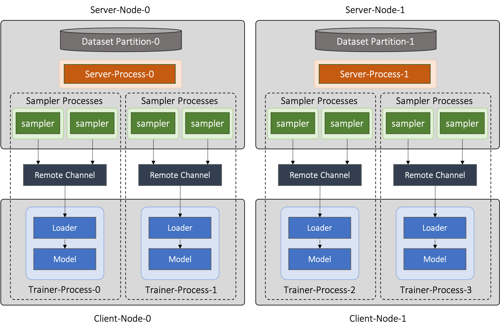

# Distributed Training

In many real-world applications, it’s often not feasible to train GNNs on
large graphs using a single machine.
GLT is a distributed python library that supports efficient
distributed GNN training across multiple machines based on the PyTorch.
GLT adopts the DDP mode pf PyTorch for distributed parallel training, and
distributes the graph data and graph-based computations across a collection of
computation resources to scale out the process of GNN training.

In GLT, distributed sampling and training processes can be completely
decoupled and deployed on different computation resources.
Such flexible deployment of GLT's distributed training can achieve more
efficient resource allocation and load balancing, as the workloads and
required computing resources corresponding to sampling and training are
usually not aligned.

GLT can further accelerate neighbor sampling and feature collection with GPUs.
To minimize the network overhead incurred by remote graph data access in
distributed training, GLT implements an asynchronous RPC framework on top of
PyTorch RPC.
Both the TCP and RDMA protocols are supported for inter-node CPU and GPU
communication.

The APIs of distributed training in GLT are similar to that of single-node
training in PyG.
In the rest of this tutorial, we will go through some important concepts
and key architecture designs of GLT's distributed module, and use examples
to illustrate how to perform distributed training in GLT.


## 1. Preprocessing and Data Partitioning

In distributed training, the graph data should be partitioned before the
training starts.
Each partition is managed by a node in the training cluster.
GLT provides a set of utility functions and partitioners to facilitate the
data preprocessing and partitioning.

As an example, we will use the `ogbn-products` dataset and demonstrate how
to partition it into two parts for distributed training.

The complete script for partitioning `ogbn-products` dataset can be found
[here](../../examples/distributed/partition_ogbn_dataset.py).

First, the following code can be used to load the `ogbn-products` dataset:

```python Load ogbn-products
import os.path as osp
import torch
from ogb.nodeproppred import PygNodePropPredDataset

# The root directory for ogbn-products dataset and partitioned results.
root_dir = '/tmp/ogbn-products'

dataset = PygNodePropPredDataset('ogbn-products', root_dir)
data = dataset[0]
node_num = len(data.x)
edge_num = len(data.edge_index[0])

# Save label data.
label_dir = osp.join(root_dir, 'label')
torch.save(data.y.squeeze(), osp.join(label_dir, 'label.pt'))
```

### 1.1 Partitioning the training input data

The `ogbn-products` dataset splits its training input data into three parts:
`train` for training, `val` for validation and `test` for testing.
We only use `train` and `test` here, and both of them should be partitioned
for parallel training:

```python Partition training input data
import torch

split_idx = dataset.get_idx_split()
num_partitions = 2

train_idx = split_idx['train']
train_idx = train_idx.split(train_idx.size(0) // num_partitions)
train_idx_partitions_dir = osp.join(root_dir, 'train-idx-partitions')
for pidx in range(num_partitions):
  torch.save(train_idx[pidx], osp.join(train_idx_partitions_dir, f'partition{pidx}.pt'))

test_idx = split_idx['test']
test_idx = test_idx.split(test_idx.size(0) // num_partitions)
test_idx_partitions_dir = osp.join(root_dir, 'test-idx-partitions')
for pidx in range(num_partitions):
  torch.save(test_idx[pidx], osp.join(test_idx_partitions_dir, f'partition{pidx}.pt'))
```

### 1.2 Partitioning the graph

GLT adopts an edge-cut method to partition graph data, node and edge features
are splitted and stored together with each graph partition, and the generated
partition mapping of graph nodes and edges will also be saved into the output
directory.
The partitioning occurs in three steps:

- (1) Run a partition algorithm to assign nodes to partitions.
- (2) Construct partition graph structure based on the node assignment.
- (3) Split the node features and edge features based on the partition result.

GLT implements a simple [`graphlearn_torch.partition.RandomPartitioner`](graphlearn_torch.partition.random_partitioner.RandomPartitioner)
to partition graph data randomly and evenly:

```python Partition graph data by random
import graphlearn_torch as glt

random_partitioner = glt.partition.RandomPartitioner(
  output_dir=osp.join(root_dir, 'graph-partitions'),
  num_parts=2,
  num_nodes=node_num,
  edge_index=data.edge_index,
  node_feat=data.x,
  edge_feat=None,
  edge_assign_strategy='by_src', # assign graph edges by src node.
  chunk_size=10000, # chunk size for node assignment
  device=torch.device(0) # device used for partitioning
)
random_partitioner.partition()
```

Besides, GLT implements another
[`graphlearn_torch.partition.FrequencyPartitioner`](graphlearn_torch.partition.frequency_partitioner.FrequencyPartitioner),
which has better hotness awareness of graph nodes and can effectively reduce
cross-machine node access during distributed sampling and feature collection.
The `FrequencyPartitioner` requires the probabilities of each graph
node being sampled at a specific sampling workload, and further assigns nodes
to different partitions according to their 'hotness'.
The hottest graph nodes will be selected for feature caches in GPUs at
each partition.
GLT's [`graphlearn_torch.sampler.NeighborSampler`](graphlearn_torch.sampler.neighbor_sampler.NeighborSampler)
provides the related APIs to calculate the sampling probabilities, but please
**note**: The sampling arguments (num_neighbors, etc.) used in probability
calculation must be the same as those used in the real distributed training
workload.
The following example will show how to calculate node hotness and how to
partition graph data with `FrequencyPartitioner`:

```python Partition graph data by frequency
import graphlearn_torch as glt

# Initialize the graph store for sampling.
csr_topo = glt.data.CSRTopo(edge_index=data.edge_index)
graph = glt.data.Graph(csr_topo, mode='ZERO_COPY')

# Calculate the sampling probabilities.
num_partitions = 2
probs = []
glt_sampler = glt.sampler.NeighborSampler(graph, num_neighbors=[15, 10, 5])
for pidx in range(num_partitions):
  seeds = train_idx[pidx]
  prob = glt_sampler.sample_prob(seeds, node_num)
  probs.append(prob)

# Partition graph data with the sampling probabilities.
freq_partitioner = glt.partition.FrequencyPartitioner(
  output_dir=osp.join(root_dir, 'graph-partitions'),
  num_parts=2,
  num_nodes=node_num,
  edge_index=data.edge_index,
  probs=probs,
  node_feat=data.x,
  edge_feat=None,
  edge_assign_strategy='by_src', # assign graph edges by src node.
  chunk_size=10000, # chunk size for node assignment
  cache_ratio=0.2, # cache 20% hottest graph nodes
  device=torch.device(0) # device used for partitioning
)
freq_partitioner.partition()
```

The partitioners of GLT also support partitioning heterogeneous graph data,
you should organize the graph and feature data as a dict.
In addition, GLT provides an abstract
[`graphlearn_torch.partition.PartitionerBase`](graphlearn_torch.partition.base.PartitionerBase)
class, you can implement your customized partitioner by inheriting it
and rewriting the logic of partitioning.

### 1.3 Loading a data partition

GLT implements the [`graphlearn_torch.distributed.DistDataset`](graphlearn_torch.distributed.dist_dataset.DistDataset)
to manage a partition dataset along with its distributed information, including
the partitioned graph data, partitioned feature data, related partition books
and the whole label data.

You can load a distributed dataset from the directory that stores
dataset partitions:

```python Load dist dataset
import os.path as osp
import graphlearn_torch as glt

root_dir = '/tmp/ogbn-products'
dist_dataset = glt.distributed.DistDataset()
dist_dataset.load(
  graph_dir=osp.join(root_dir, 'graph-partitions'),
  partition_idx=0, # load datat partition 0
  graph_mode='ZERO_COPY',
  whole_node_label_file=osp.join(root_dir, 'label', 'label.pt')
)
```


## 2. Deployment Mode

GLT's distributed training has two basic types of processes: sampler and trainer:

- **Sampler Process** creates the distributed sampler and performs distributed
neighbor sampling and feature collection. The sampled results will be sent to
the sampling message channel, which will be further consumed for training tasks.
- **Trainer Process** corresponds to a distributed unit of PyTorch's DDP, loads
sampled results from the sampling message channel and performs model training.
Generally, each trainer process will occupy a GPU for training. A trainer
process is responsible for creating its own message channel and can launch one
or more sampler processes for sampling, all sampler processes launched by it
will send their sampeld results to this channel. Note that the number of sampler
processes launched by each distributed trainer process must be the same.

All these processes can be distributed across different machines flexibly.
A sampler process and a trainer process can be collocated at a same machine
or not.
This is helpful when you want to differentiate the computing resources
allocated to sampling and training tasks.

In order to better manage distributed process deployment, GLT's distributed
training provides two standard deployment modes: **worker mode** and
**server-client** mode.
You should follow these two modes when using GLT's distributed training.

### 2.1 Worker Mode (Basic Mode)

The worker mode is the basic mode of GLT's distributed training.
In this mode, each machine corresponds to a specific worker node.
All trainer processes are distributed on these worker nodes that perform
model training in parallel.

Each trainer process can spawn multiple sampler processes for neighbor sampling
and feature collection, which are located on the same worker node as this
trainer process.
A shared-memory message channel will be created for transmitting sampled results
from spawned sampler processes to the corresponding trainer process.

The distributed datasets are managed by different worker nodes.
In specific, each worker node that hold the trainer processes will exclusively
manage a dataset partition, which is shared by all the trainer processes and
sampler processes in this machine.

The figure below shows the architecture of this deployment mode:


GLT introduces the
[`graphlearn_torch.distributed.DistContext`](graphlearn_torch.distributed.dist_context.DistContext)
to manage the distributed location and context information for each distributed
process.
At the beginning of each trainer process, you should initialize the distributed
process context with
[`graphlearn_torch.distributed.init_worker_group`](graphlearn_torch.distributed.dist_context.init_worker_group).
E.g, if we have 4 distributed trainer processes, the following example will
show how to initialize the worker group on trainer-0:

```python Initialize worker group
import graphlearn_torch as glt

glt.distributed.init_worker_group(
  world_size=4,
  rank=0,
  group_name='distributed-trainer'
)
```

After initialization, you can further check the distributed context:

```python Check distributed context
dist_ctx = glt.distributed.get_context()
# The role type of the current worker group: WORKER
dist_ctx.role
# The number of all distributed trainer processes
dist_ctx.world_size
# The rank of the current trainer process
dist_ctx.rank
# The group name of all distributed trainer processes
dist_ctx.group_name
# The worker name of the current trainer process
dist_ctx.worker_name
```

### 2.2 Server-Client Mode (Separate Mode)

Besides the worker mode, GLT also provides the server-client mode that supports
separating trainer processes and sampler processes on different machines.
In this mode, there are two kinds of machine groups in the cluster, namely
**server node** and **client node**.
GLT introduces a new **server process** type for the server-client mode, all
server processes will be distributed on server nodes and responsible for serving
requests from clients.

The trainer processes are distributed on all client nodes, and each trainer
process will manage a client to interact with remote server processes.
Before training, a trainer process will first request a specific server process
to create a few sampler processes on the remote server node.
Then, a remote message channel will be created, the sampled results produced
by these sampler processes will be sent to this channel and further consumed
by the current trainer process for training.

In the server-client mode, the distributed datasets with graph and feature data
are managed only by server nodes, and the client nodes will only use the
distributed training input data for their training tasks.
In specific, each server node will exclusively manage a dataset partition,
which is shared by all the server processes and created sampler processes
in this machine.

As an example, we create a cluster of 2 server nodes and 2 client nodes.
Each server node handles 1 server process and each client node handles 2
trainer processes.
For a specific trainer process, it will request a server to create 2 remote
sampler processes.
The figure below shows the architecture of the server-client deployment mode
in this case:



Similar to the worker mode, you also need to initialize the distributed process
context at the beginning of each server and trainer client process.
GLT provides [`graphlearn_torch.distributed.init_server`](graphlearn_torch.distributed.dist_server.init_server)
and [`graphlearn_torch.distributed.init_client`](graphlearn_torch.distributed.dist_client.init_client)
to initialize the server and client on the corresponding processes.
E.g, if we have 2 distributed server processes and 4 distributed trainer client
processes, you can initialize the server process with:

```python Initialize server process
import graphlearn_torch as glt

# Initialize server-0
glt.distributed.init_server(
  num_servers=2,
  num_clients=4,
  server_rank=0,
  # The distributed dataset managed by the current server node.
  dataset=dist_dataset,
  # The master address and port used for build connection across all server
  # and trainer client processes, which should be same at all server and client
  # processes.
  master_addr='localhost',
  master_port=11111,
  # The number of RPC worker threads for requests.
  num_rpc_threads=16,
  # The group name of all server processes.
  server_group_name='distributed-server'
)

# Run server and wait for exit.
glt.distributed.wait_and_shutdown_server()
```

And initialize the trainer client process with:

```python Initialize client process
import graphlearn_torch as glt

# Initialize client-1
glt.distributed.init_client(
  num_servers=2,
  num_clients=4,
  client_rank=1,
  master_addr='localhost',
  master_port=11111,
  num_rpc_threads=4,
  # The group name of all client processes.
  client_group_name='distributed-trainer-client'
)

# Load sampled messages and perform training.
# ...

# Shutdown the current process before exiting.
glt.distributed.shutdown_client()
```

After initialization, you can also check the distributed context of server
processes or trainer client processes:

```python Check distributed context of servers or clients
dist_ctx = glt.distributed.get_context()
# The role type of the current worker group: SERVER or CLIENT.
dist_ctx.role
# The number of all processes of the current role group.
dist_ctx.world_size
# The rank of the current process within the current role group.
dist_ctx.rank
# The name of the current role group.
dist_ctx.group_name
# The name of the current process.
dist_ctx.worker_name
# The number of all distributed server and client processes.
dist_ctx.global_world_size
# The rank of the current process within all server and client processes.
dist_ctx.global_rank
```


## 3. Asynchronous and Concurrent Sampler

For the sampling tasks when training GNNs on a single machine, all graph data
access will be local, the samplers can be non-blocking and process the input
batches sequentially one by one.
However, in the distributed sampling, part of the sampling tasks of an input
batch may take place on the local machine, while other parts need to be
executed on other machines and incur heavy cross-machine network I/Os.
It is simple but inefficient to wait for blocking I/O operations while
processing each input batch, as most computing time slices are wasted by useless
waiting.

GLT implements an asynchronous
[`graphlearn_torch.distributed.DistNeighborSampler`](graphlearn_torch.distributed.dist_neighbor_sampler.DistNeighborSampler)
to pipeline the sampling tasks of different input batches and execute them
concurrently.
Each `DistNeighborSampler` will maintain a
[`graphlearn_torch.distributed.ConcurrentEventLoop`](graphlearn_torch.distributed.event_loop.ConcurrentEventLoop),
which is implemented on top of Python's `asyncio`, and further ship the remote
sampling tasks of an input batch to other samplers with RPC requests.
At the same time, the related futures and callbacks will be registered for
subsequent processing, and the distributed sampler can switch to the next input
batch immediately without being blocked.
Once a future is ready, its callback will stitch different parts of the
corresponding sampled results and send them to the sampling message channel.
These sampling messages will be consumed by trainer processes for further training.

Collecting features stored in the distributed cluster will also incur network I/Os.
Samilar to the asynchronous neighbor sampling, the `DistNeighborSampler` can
also pipeline the operations of distributed feature lookup and execute them
concurrently.

For convenience, GLT implements a distributed neighbor loader, which provides a
higher level of abstraction and hide the details of creating and using the
distributed samplers.
The next section shows how to use the distributed neighbor loader.


## 4. Using Distributed Neighbor Loader

It is relatively complicated for users to launch sampler processes manually,
including creating samplers and establishing RPC connections across them.
GLT implements an [`graphlearn_torch.distributed.DistNeighborLoader`](graphlearn_torch.distributed.dist_neighbor_loader.DistNeighborLoader)
to wrap these sampling steps and also the dataloading step for trainer processes.
An `DistNeighborLoader` should be created on a trainer process, it will
launch sampler processes for neighbor sampling and feature collection, create
a channel for sampled message passing and consume the messages for training.

GLT provides concise and easy-to-use APIs for loading sampled results with
`DistNeighborLoader`, you can simply use it as an iterator like PyTorch's
dataloader.
The `DistNeighborLoader` is also fully compatible with PyG's training APIs, the
format of the sampled results is exactly the same as PyG's, you can apply it to
your PyG training scipts with only a few lines of modifications.

GLT provides different option groups when creating the `DistNeighborLoader`.
An option group corresponds to a specific deployment mode and is used to
specify the detailed options for launching sampler processes of the loader.

### 4.1 In the Worker Mode

GLT provides a standard option group
[`graphlearn_torch.distributed.MpDistSamplingWorkerOptions`](graphlearn_torch.distributed.dist_options.MpDistSamplingWorkerOptions)
to launch sampler processes for `DistNeighborLoader` in the worker
deployment mode.
On each worker process, the example bellow shows how to create an
`DistNeighborLoader` and use it for training:

```python Create DistNeighborLoader with mp options
import graphlearn_torch as glt

mp_options = glt.distributed.MpDistSamplingWorkerOptions(
  # The number of sampler processes to launch.
  num_workers=2,
  # Devices assigned to the sampler processes.
  worker_devices=[torch.device('cuda', i % torch.cuda.device_count() for i in range(2))],
  # Max concurrency for async sampling of each distributed sampler.
  worker_concurrency=4,
  # The master address and port used for build connection across all sampler
  # processes, which should be same for each loader.
  master_addr='localhost',
  master_port=11112,
  # The shared-memory size allocated to the channel.
  channel_size='1GB',
  # Set to true to register the underlying shared memory for CUDA, which will
  # achieve better performance if you want to copy the loaded data from channel
  # to CUDA device.
  pin_memory=True
)

train_loader = glt.distributed.DistNeighborLoader(
  # The distributed dataset managed by the current worker node.
  data=dist_dataset,
  # The number of neighbors for each sampling hops.
  num_neighbors=[15, 10, 5],
  # The partitioned training input data for the current trainer process.
  input_nodes=train_idx,
  # Size of mini-batch.
  batch_size=1024,
  # Set to true to collect node features for sampled subgraphs.
  collect_features=True,
  # All sampled results will be moved to this device.
  to_device=torch.device(0),
  # Use `MpDistSamplingWorkerOptions`.
  worker_options=mp_options
)
```

As shown in this example, after creating the training loader with
`MpDistSamplingWorkerOptions`, the current trainer process will spawn
`num_workers=2` sampler processes, each with an assigned CUDA device.
Each sampler process will further create a distributed sampler with
`concurrency=4` to perform asynchronus neighbor sampling, and establish RPC
connections with each other via `master_addr:master_port (localhost:11112)`.
An shared-memory channel with `channel_size='1GB'` will be created for
inter-process message passing, the underlying CPU memory is pinned by setting
`pin_memory=True` for better data copy performance from CPU to CUDA devices.

Once an `DistNeighborLoader` is created, you can simply load sampled results
from it and perform model training, the format of sampled results is the
same as PyG's `torch_geometric.data.Data`/`torch_geometric.data.HeteroData`.

```python Use DistNeighborLoader
import graphlearn_torch as glt
import torch
import torch.nn.functional as F
from torch.nn.parallel import DistributedDataParallel
from torch_geometric.nn import GraphSAGE

# Define model and optimizer.
model = GraphSAGE(
  in_channels=num_in_feats,
  hidden_channels=256,
  num_layers=3,
  out_channels=num_classes,
)
model = DistributedDataParallel(model, device_ids=[current_device.index])
optimizer = torch.optim.Adam(model.parameters(), lr=0.01)

# Train for 10 epochs
for epoch in range(10):
  model.train()
  # load sampled subgraphs from `train_loader`.
  for batch in train_loader:
    optimizer.zero_grad()
    out = model(batch.x, batch.edge_index)[:batch.batch_size].log_softmax(dim=-1)
    loss = F.nll_loss(out, batch.y[:batch.batch_size])
    loss.backward()
    optimizer.step()
```

The complete example of distributed training in the worker mode can be found
[here](../../examples/distributed/dist_train_sage_supervised.py)

In the worker deployment mode, GLT also provides another option group
[`graphlearn_torch.distributed.CollocatedDistSamplingWorkerOptions`](graphlearn_torch.distributed.dist_options.CollocatedDistSamplingWorkerOptions).
When using this option group, the `DistNeighborLoader` will not spawn new
processes for sampling, the distributed samplers will be created inside the
trainer processes.
The shared-memory message channel will not be created, the sampling of
distributed samplers will be synchronous in this mode, and the input batches
are processed one by one.
This option is generally **Not Recommended** due to its poor performance,
except for some special cases, e.g, if the sampling workload is very small, it
might not be cost-effective to spawn new processes, as pickling the distributed
datatset into a new process also has a certain cost.
You can follow the example bellow to create an `DistNeighborLoader` with this
option group:

```python Create DistNeighborLoader with collocated options
import graphlearn_torch as glt

collocated_options = glt.distributed.CollocatedDistSamplingWorkerOptions(
  # Specifing master address and port is enough.
  master_addr='localhost',
  master_port=11112,
)

train_loader = glt.distributed.DistNeighborLoader(
  data=dist_dataset,
  num_neighbors=[15, 10, 5],
  input_nodes=train_idx,
  batch_size=1024,
  collect_features=True,
  to_device=torch.device(0),
  worker_options=collocated_options
)
```

### 4.2 In the Server-Client Mode

For the server-client deployment mode, GLT provides a standard option group
[`graphlearn_torch.distributed.RemoteDistSamplingWorkerOptions`](graphlearn_torch.distributed.dist_options.RemoteDistSamplingWorkerOptions).
With this option group, you can create the `DistNeighborLoader` on trainer
client processes and launch its sampler processes on the remote server nodes.
Follow this example below to learn how to use it:

```python Create DistNeighborLoader with remote options
import graphlearn_torch as glt

# The `DistNeighborLoader` should be created on the trainer client process.
# Before get the distributed context of the current client process, you must
# initialize the client first.
dist_ctx = glt.distributed.get_context()

# Select a target server process on remote.
target_server_rank = dist_ctx.rank % dist_ctx.num_servers()

# Fetch availble device count on the target server.
target_server_device_count = glt.distributed.request_server(
  target_server_rank,
  func=torch.cuda.device_count
)

remote_options = glt.distributed.RemoteDistSamplingWorkerOptions(
  # The target server rank to launch sampler processes.
  server_rank=target_server_rank,
  # The number of sampler processes to launch on the target server.
  num_workers=2,
  # Devices on the target server assigned to the sampler processes.
  worker_devices=[torch.device('cuda', i % target_server_device_count) for i in range(2)],
  # Max concurrency for async sampling of each distributed sampler.
  worker_concurrency=4,
  # The master address and port used for build connection across all sampler
  # processes, which should be same for each loader.
  master_addr='localhost',
  master_port=11112,
  # The memory size allocated to the server-side buffer.
  buffer_size='1GB',
  # The number of sampled messages to prefetch from the remote message channel.
  prefetch_size=4
)

train_loader = glt.distributed.DistNeighborLoader(
  # No need to provide a distributed dataset.
  data=None,
  num_neighbors=[15, 10, 5],
  input_nodes=train_idx,
  batch_size=1024,
  collect_features=True,
  to_device=torch.device(0),
  worker_options=remote_options
)
```

As shown in this example, after creating the training loader with
`RemoteDistSamplingWorkerOptions`, the current trainer process will select a
target server process by `dist_ctx.rank % dist_ctx.num_servers()` and request
it to spawn `num_workers=2` sampler processes on the target server node.
Each sampler process will further create a distributed sampler with
`concurrency=4` to perform asynchronus sampling, and establish RPC connections
with each other via `master_addr:master_port (localhost:11112)`.
On the server side, the target server process will create a buffer with
`buffer_size='1GB'` to cache sampled messages.
A remote message channel will be created, and the training loader on
the trainer process will use it to consume messages from the server-side buffer
with `prefetch_size=4`.
Note that, for the server-client deployment mode, there is no need to provide
a distributed dataset when creating the `DistNeighborLoader`, as all dataset
partitions are managed by server nodes.

The complete example of distributed training in the server-client mode can be
found [here](../../examples/distributed/dist_train_sage_supervised_with_server.py)
